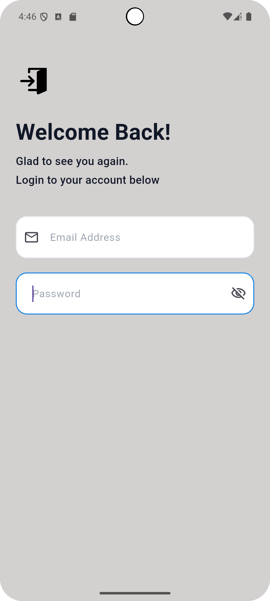
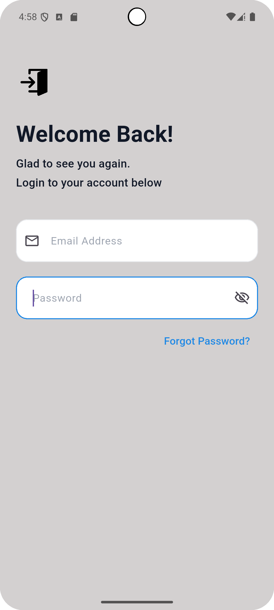
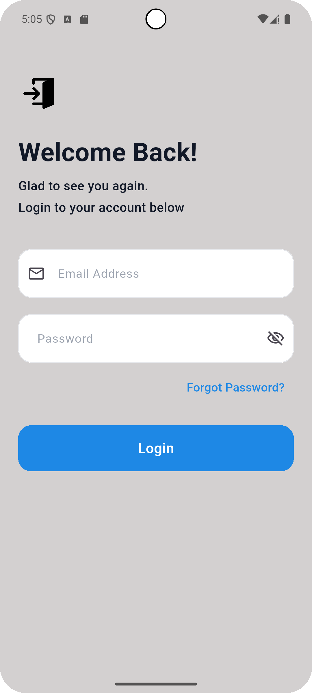
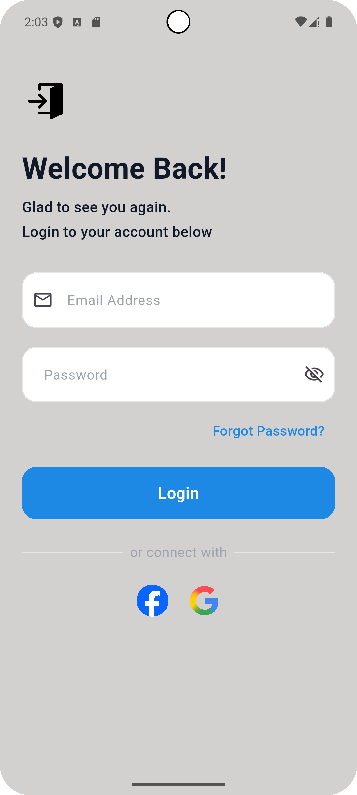

# Fad Task

A modern and responsive Flutter Login Screen developed using reusable widgets, a clean folder structure, and Material 3 design principles.

---

## ✨ Features

- Responsive UI
- Reusable Widgets
- Clean Folder Structure
- Material 3 Design
- ScreenUtil Responsive Layout

---

## 📸 Screenshots

### Login Screen



### Login Form



### Social Login



### Complete Screen



---

## 🛠 Tech Stack

- Flutter SDK
- Dart
- Material 3
- flutter_screenutil
- flutter_svg

---

## 📂 Folder Structure

```text
lib
├── core
│   ├── constants
│   ├── routes
│   ├── shared_widgets
│   ├── theme
│   └── utils
│
├── features
│   ├── auth
│   │   └── presentation
│   │       ├── ui
│   │       └── widgets
│   │
│   └── home
│
├── generated
├── fad_task.dart
└── main.dart
```

---

## 🚀 Getting Started

### 1. Clone the repository

```bash
git clone https://github.com/AmrReda92/fad-task.git
```

### 2. Install dependencies

```bash
flutter pub get
```

### 3. Run the application

```bash
flutter run
```

---

## 📌 Project Requirements

This project was developed to satisfy the following requirements:

- Clean Folder Structure
- Responsive Login Screen
- Reusable Widgets
- GitHub Repository
- README Documentation
- Clean Commit History

---

## 👨‍💻 Author

**Amr Reda**